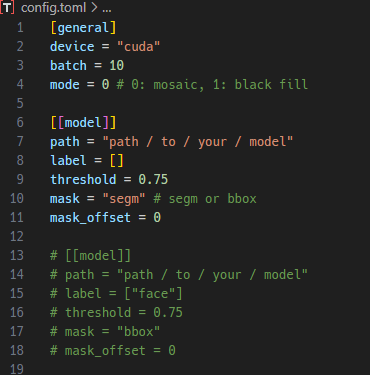

# YOLO-CENSOR

## インストール
1. 仮想環境作成、有効化
   ```
   python -m venv venv
   ```
   ```
   .\venv\scripts\activate
   ```

2. cudaを使用する場合はtorch, torchvisionをインストール  
   python3.12, cuda126でテストしていますが、他のバージョンでもだいたい動くと思います  
   cpuでも動作しますが、だいぶ遅いです
   ```
   pip install torch torchvision --index-url https://download.pytorch.org/whl/cu126
   ```

3. 他依存関係インストール
   ```
   pip install -r requirements.txt
   ```


## 使い方
1. YOLOモデルのダウンロード  
   civitai等から好きなモデルをダウンロードしてください

2. config.tomlの編集  
   
   

   - **general**
     - device: cuda or cpu
     - batch: バッチサイズ(ちょっと処理が早くなる)
     - mode: 修正方法のモード(0: モザイク, 1: 黒埋め, 2: 画像合成)
     - mosaic_size: 上記mode = 0: モザイクモードでのサイズ(0: auto(長辺の1/100), 1~: 任意のサイズ)
     - mask_image: 上記mode = 2: 画像合成モードでのマスク画像パス
   - **model**  
     このmodelセクションは複数設定できます。
     - path: モデルへのパス
     - label: 検出するラベル(リストで複数指定可能。例: label = ["face", "eyes"])
     - threshold: 検出する閾値
     - mask: マスクのモード(segm: セグメント, bbox: ボックス)
     - mask_offset: マスクをoffset分だけ拡大する

3. main.pyの実行
   ```
   python main.py --target your/target/dir_or_file/path
   ```
   - **--target** 引数でフォルダかファイルを指定できます  
   - **--target** 引数を省略した場合、CLIにてパスを質問されるので入力してください

4. 画像と同じディレクトリにcensoredフォルダが作成され、修正が行われた場合のみ同名ファイルで保存されます。


## 注意
- 対象となるのは画像 (.png / .jpg / .jpeg / .webp) のみです。
- **動画およびアニメーションwebpには対応していません (フォルダ内にあってもスキップされます)**
- ComfyUI, sd-webui等のメタデータは削除されます。


## TODO
以下、時間があるときにやる
- metadataの保持オプション
- 動画、アニメーションwebp対応
- ~~モザイクピクセル大きさ指定~~ (done: 2025/03/23)
- ~~画像貼り付けモード追加~~ (done: 2025/03/23)
